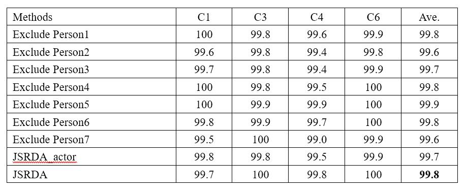

# JSRDA
Methods and results for paper "Hierarchically Learned View-Invariant Representations for Cross-View Action Recognition"

### Abstract
Recognizing human actions from varied views is challenging due to huge appearance variations in different views. The key to this problem is to learn discriminant view-invariant representations generalizing well across views. In this paper, we address this problem by learning view-invariant representations hierarchically using a novel method, referred to as Joint Sparse Representation and Distribution Adaptation (JSRDA). To obtain robust and informative feature representations, we first incorporate a sample-affinity matrix into the marginalized stacked denoising Autoencoder (mSDA) to obtain shared features, which are then combined with the private features. In order to make the feature representations of videos across views transferable, we then learn a transferable dictionary pair simultaneously from pairs of videos taken at different views to encourage each action video across views to have the same sparse representation. However, the distribution difference across views still exist because a unified subspace where the sparse representations of one action across views are the same may not exist when the view difference is large. Therefore, we propose a novel unsupervised distribution adaptation method that learns a set of projections that project the source and target views data into respective low-dimensional subspaces where the marginal and conditional distribution differences are reduced simultaneously. Therefore, the finally learned feature representation is view-invariant and robust for substantial distribution difference across views even the view difference is large. Experimental results on four multi-view datasets show that our approach outperforms the state-of-the-art approaches.

### Model

Framework of our proposed JSRDA. The framework is hierarchical as the view-invariant representation is learned in a coarse-to-fine fashion. 

### Experimental results 
Detailed expermental results and related disscussions can be found in the paper.
Here, we provide some extra experiments and results which are not included in the original paper.

1) Regarding the partioning of the datasets, it appears that samples of the same video/action are in both training and testing partitions. Therefore, we have conducted an experiment where the same action performed by the same actor does not appear in both training and testing partitions. That way, it'll be possible to understand if the proposed solution is able to generalize both the view and the action class, avoiding the possibility that the actions are being identified by memorization of appearance and motion cues that were present during training. 

To evaluate the performance of our method when the same action performed by the same actor does not appear in both training and testing partitions, we use the leave-one-actor-out strategy for training and testing which means that each time one actor is excluded from both training and testing procedure. We report the classification accuracy by averaging all possible combinations for excluding actors. We conduct experiments for multi-view action recognition task on the MuHAVi dataset. This dataset contains 17 action classes and each action is performed by 7 actors. To reduce the computational burden and have a fair comparison with other works, we follow (J. Zheng, Z. Jiang, and R. Chellappa, “Cross-view action recognition via transferable dictionary learning,” IEEE Trans. Image Processing, vol. 25, no. 6, pp. 2542–2556, 2016) and (X. Wu and Y. Jia, “View-invariant action recognition using latent kernelized structural SVM,” in ECCV 2012, pp. 411–424) to choose the action videos captured by four cameras (C1, C3, C4, C6) in our experiments. The table below shows the experimental results.

Performance comparison of multi-view action recognition task on the MuHAVi dataset for different combinations for excluding actors. C1, C3, C4 and C6 denote Camera 1, Camera 3, Camera 4 and Camera 6 respectively.

### Datasets
InfAR dataset can be downloaded [here](https://sites.google.com/site/gaochenqiang/publication/infrared-action-dataset).

NTU RGB+D dataset can be downloaded [here](http://rose1.ntu.edu.sg/Datasets/actionRecognition.asp).
